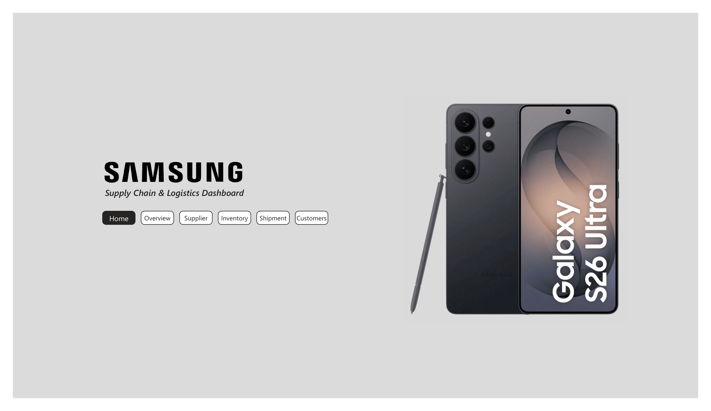
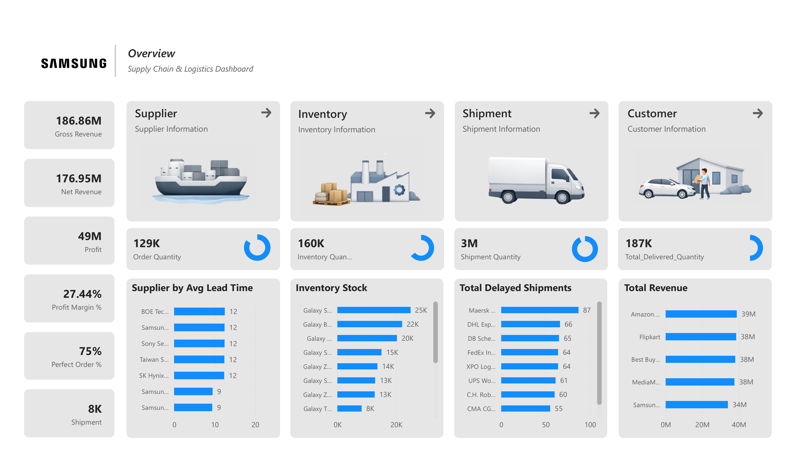
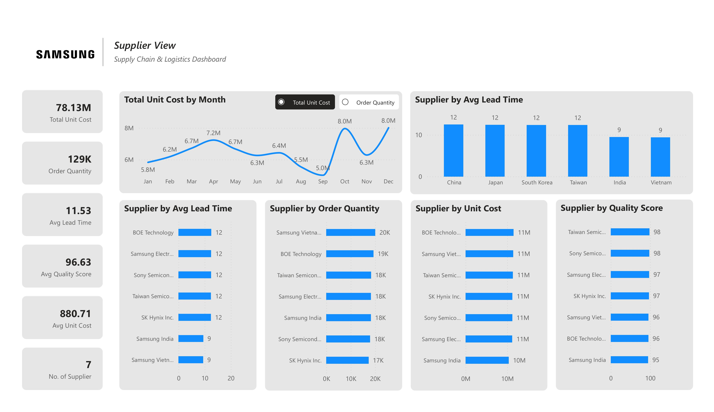
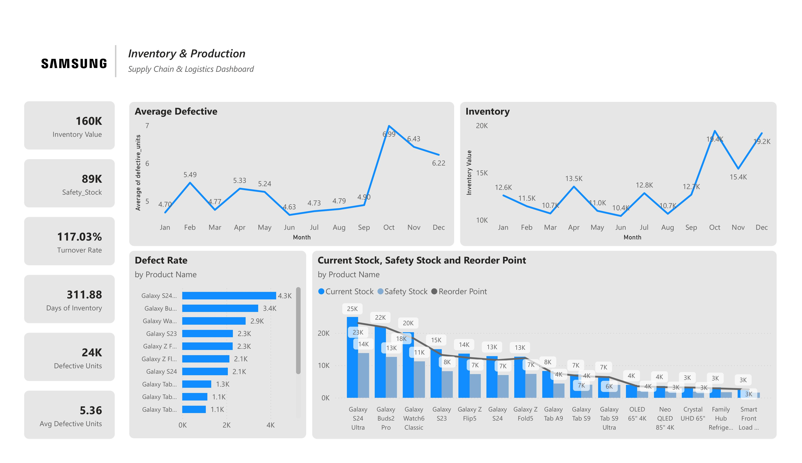
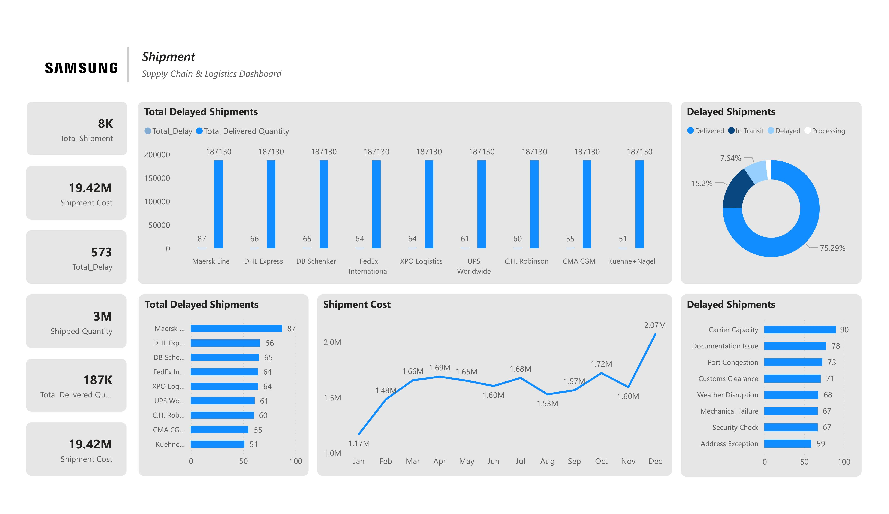
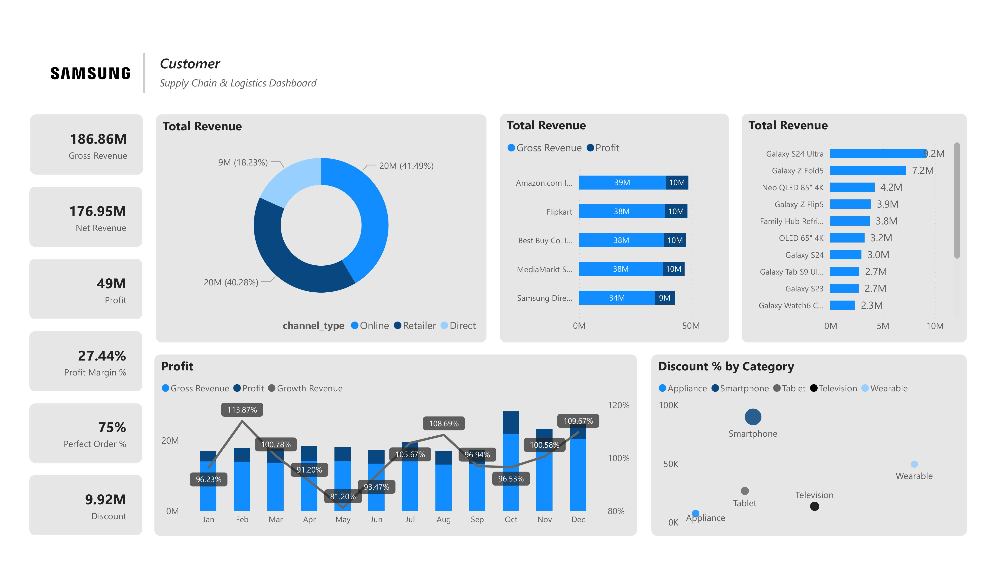

# Samsung Supply Chain & Logistics Dashboard

Enterprise-Style Power BI Dashboard for End-to-End Supply Chain Analytics

**Tools:** Power BI • Power Query • DAX • Data Modeling  
**Domain:** Supply Chain & Logistics  
**Skills Demonstrated:** KPI Reporting • Inventory Analytics • Shipment Analytics • Supplier Analytics • Customer Revenue Analytics • Data Visualization

---

## Project Overview

This project presents an interactive Power BI dashboard designed to monitor Samsung's end-to-end supply chain performance. The dashboard integrates procurement, inventory, production, shipment, and sales data to provide actionable insights for operational and strategic decision-making.

The solution enables stakeholders to monitor business performance, identify bottlenecks, optimize inventory levels, and improve supply chain efficiency.

---

## Business Objectives

- Monitor supplier performance and lead times.
- Track inventory health and stock availability.
- Analyze shipment delays and logistics performance.
- Evaluate customer revenue and profitability.
- Support data-driven decision-making across supply chain operations.

---

## Tools & Technologies Used

- Power BI Desktop
- Power Query
- DAX (Data Analysis Expressions)
- CSV Datasets
- Data Modeling
- Interactive Dashboard Design

---

## Data Model

### Dimension Tables
- dim_customer
- dim_date
- dim_facility
- dim_product
- dim_supplier

### Fact Tables
- fact_sales
- fact_inventory
- fact_procurement
- fact_production
- fact_shipment

### Business Process Flow

Supplier → Procurement → Production → Inventory → Shipment → Customer Sales

---

## Dashboard Pages

### 1. Executive Overview
Provides a high-level view of business performance through key metrics including:
- Gross Revenue
- Net Revenue
- Profit
- Profit Margin
- Perfect Order Rate
- Order Quantity
- Inventory Quantity
- Shipment Quantity

---

### 2. Supplier Analytics
Analyzes supplier performance using:
- Average Lead Time
- Order Quantity
- Unit Cost
- Quality Score
- Monthly Procurement Trends
- Supplier Comparison by Country

---

### 3. Inventory & Production Analytics
Monitors inventory efficiency and production quality through:
- Inventory Value
- Safety Stock
- Turnover Rate
- Days of Inventory
- Defective Units
- Stock Levels vs Reorder Points

---

### 4. Shipment Analytics
Tracks logistics performance through:
- Shipment Cost
- Delayed Shipments
- Delivered Quantity
- Delay Trends
- Delay Root Cause Analysis
- Logistics Provider Performance

---

### 5. Customer Analytics
Evaluates business performance using:
- Revenue by Customer
- Revenue by Channel
- Profit Trends
- Product Performance
- Discount Analysis
- Revenue Growth Trends

---

## Key Performance Indicators (KPIs)

| KPI | Value |
|-----|--------|
| Gross Revenue | 186.86M |
| Net Revenue | 176.95M |
| Profit | 49M |
| Profit Margin | 27.44% |
| Perfect Order Rate | 75% |
| Order Quantity | 129K |
| Inventory Quantity | 160K |
| Shipment Quantity | 3M |
| Delivered Quantity | 187K |
| Shipment Cost | 19.42M |

---

## Dashboard Preview

### Landing Page


### Overview Dashboard


### Supplier Analytics


### Inventory & Production


### Shipment Analytics


### Customer Analytics


---

## Key Insights
- Production costs peak in October and December.
- Sales are highly concentrated on Amazon and Flipkart.
- Smartphones drive the majority of sales, but heavy discounting is eroding profitability.
- Defective units need proactive quality management.

## Recommendations
- Increase procurement and inventory buildup in September when costs are lower to minimize expensive Q4 purchases and improve overall cost efficiency.
- Drive D2C adoption through Samsung Store exclusive colours and free screen insurance bundles to shift customers from marketplaces to direct purchases and improve margins.
- Test a 2% to 3% reduction in smartphone discounts. If sales volumes remain stable, Samsung can significantly improve margins and unlock millions in additional profit.
- Monitor defect-prone products proactively.

---

## Business Impact

This dashboard enables stakeholders to:

- Monitor end-to-end supply chain performance in real time.
- Identify operational bottlenecks and shipment risks.
- Optimize inventory management and replenishment planning.
- Evaluate supplier efficiency and procurement effectiveness.
- Support strategic decisions using data-driven insights.

---

## Repository Structure

```text
Samsung Supply Chain Dashboard
│
├── Samsung_Supply_Chain.pbix
├── Samsung_Supply_Chain.pdf
├── dataset
│   ├── dim_customer.csv
│   ├── dim_date.csv
│   ├── dim_facility.csv
│   ├── dim_product.csv
│   ├── dim_supplier.csv
│   ├── fact_inventory.csv
│   ├── fact_procurement.csv
│   ├── fact_production.csv
│   ├── fact_sales.csv
│   └── fact_shipment.csv
│
└── screenshots
    ├── overview.png
    ├── supplier.png
    ├── inventory.png
    ├── shipment.png
    └── customer.png
```

---

## Author

**Himanshu Rajput**  
MBA Candidate at Symbiosis International University  
Business Analyst | Excel • SQL • Power BI
